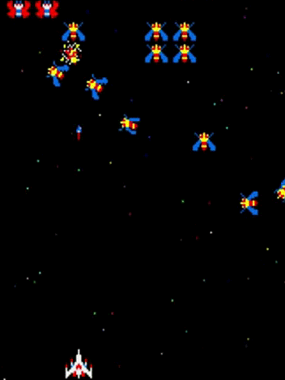

## GALAGA

## Tabla de contenidos

- [Descripción](#descripción)
- [Reglas](#reglas-del-juego--instrucciones)
- [Impacto en la cultura del videojuego](#Impacto)
- [Equipo de desarrollo](#Equipo)
- [Otros](#Otros)

## Descripción 

El juego Galaga hecho con Wollok-Game. El jugador controla una nave que debe enfrentarse contra un enjambre de alienígenas con forma de insecto y actuando como kamikazes, se necesita un disparo para eliminar al enemigo. Además este juego contiene dos niveles. Destruye las oleadas de alienígenas en este juego de disparos espacial. 
¡Animate a jugarlo y consigue la puntuación perfecta!

## Reglas del Juego / Instrucciones

- Al iniciar el juego presionar "Enter" para comenzar.
- El avión se desplaza hacia la derecha presionando la tecla "d" y hacia la izquierda presionando la tecla "a".
- El avión dispara al enemigo presionando la tecla "w".
- Para derrotar a los jefes finales, deberan de golpear su punto más debil. Cual es su punto debil? Bueno si apuntas a su pie derecho posiblemente tengas mas chances de matarlo, ya que su cuerpo tiene un blindaje que evade los disparos.

## Impacto en la cultura del videojuego

Galaga no solo se ganó el reconocimiento de los jugadores por su jugabilidad adictiva, sino que también dejó una huella duradera en la cultura del videojuego. Su legado perdura a lo largo de las décadas, siendo recordado como uno de los grandes clásicos de la época dorada de los arcade.

## Equipo de desarrollo

- Lucia Turreiro
- Guillermo Ezequiel Castro
- Eliel Dario Remonda
- Leonel Agustin Arce
- Nair Amira Paz

## Otros

- Trabajo Práctico Integrador de la materia Programación con Objetos I, de la Universidad Nacional de Hurlingham - UNAHUR
- Proyecto Wollok - Año 2024

